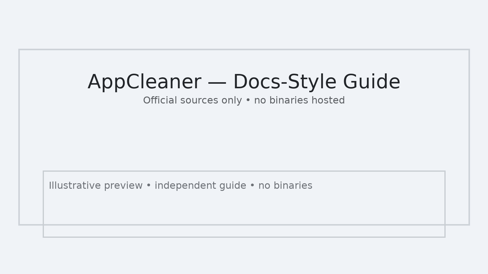

# AppCleaner (macOS) — Get Started in Minutes



**AppCleaner** helps you remove macOS apps and their related files in a safe, transparent way.  
This repository is a **documentation-only** quick start. It does **not** host binaries, mirrors, or modified installers.

<p align="center">
  <a href="#installation"></a>
  <a href="https://freemacsoft.net/appcleaner/" rel="noopener noreferrer"></a>
  <a href="#option-a—homebrew"></a>
</p>

---

## Who It’s For
- macOS users who want clean app removal
- Power users who prefer scripted or repeatable setups
- IT/onboarding flows that need simple documentation
- Test environments that require easy install/uninstall

---

## Prerequisites
- **macOS:** 11 Big Sur or newer recommended  
- **Network:** Only to fetch from official/trusted sources  
- **Disk space:** ~50 MB for the application and temporary files

---

## Installation

### Option A—Homebrew
If you already use Homebrew, install the cask:

```bash
brew install --cask appcleaner
```

### Option B—Manual (official source)
1. Open the **official website**: <https://freemacsoft.net/appcleaner/>
2. Download the latest DMG/ZIP from the site.
3. Move **AppCleaner.app** to **Applications** and launch it.

> This repository does **not** host any downloads. Always use the official website or the Homebrew cask.

---

## Configure (Optional)
- In AppCleaner preferences, review search options for related files.
- Keep Time Machine enabled so you can roll back changes if needed.

---

## Verify (Optional)
To verify a downloaded file, compute its hash locally:

```bash
cd ~/Downloads
shasum -a 256 AppCleaner*.dmg
```

Compare with the hash provided by the official source (if available).

---

## Update & Uninstall
- **Update (Homebrew):** `brew upgrade --cask appcleaner`  
- **Uninstall (Homebrew):** `brew uninstall --cask appcleaner`  
- **Manual uninstall:** remove **AppCleaner.app** from **Applications**; optional preferences live under `~/Library/Preferences/` and `~/Library/Application Support/`.

---

## Best Practices
- Close target apps before cleaning to avoid “in use” files.
- Review the list of related files before confirming removal.
- Periodically check the official website for updates.

---

## Troubleshooting
- **App not detected:** open the target app once, then retry.  
- **Files locked:** quit the app or restart macOS.  
- **Permission prompts:** grant access so AppCleaner can search related files.

---

## Privacy & Security
- This guide does not collect data.  
- Installation sources are limited to the **official website** and **trusted package managers**.

---

## Legal & Trademarks
- Independent, educational guide. Not affiliated with AppCleaner or its authors.  
- **No binaries hosted.** Links go only to official or trusted sources.  
- Trademarks and product names belong to their respective owners.

---

## Support
- For this guide: open an issue in this repository.  
- For the application: visit the official website and documentation.
